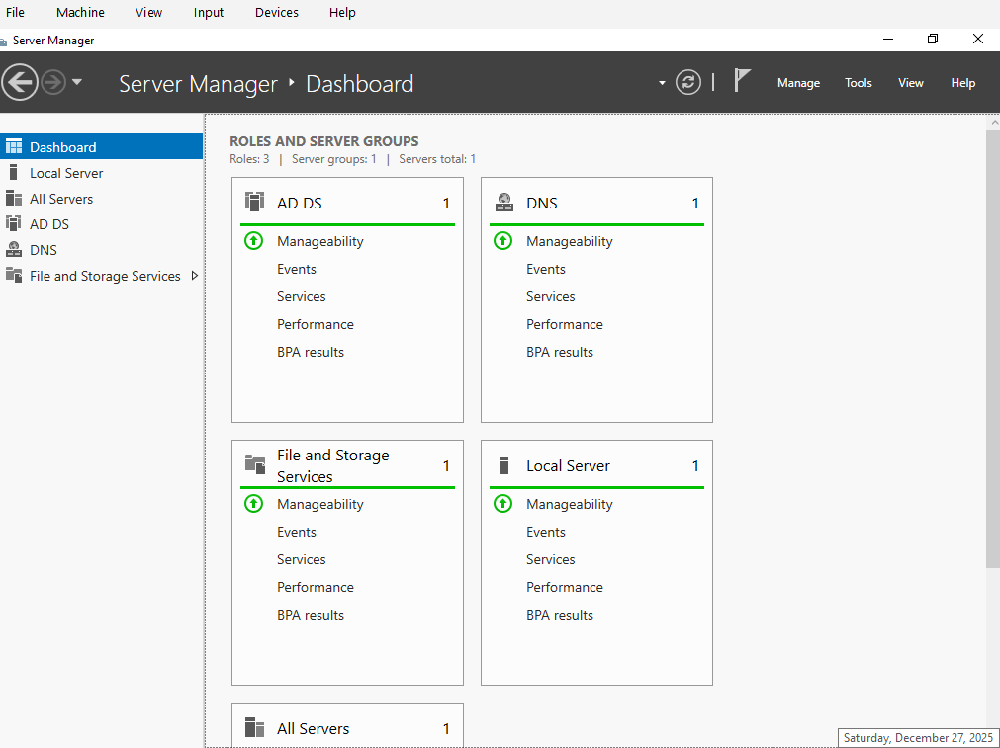
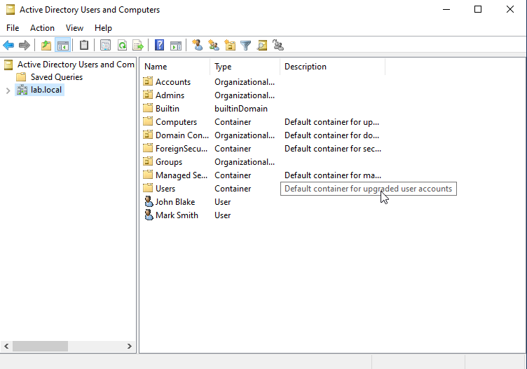
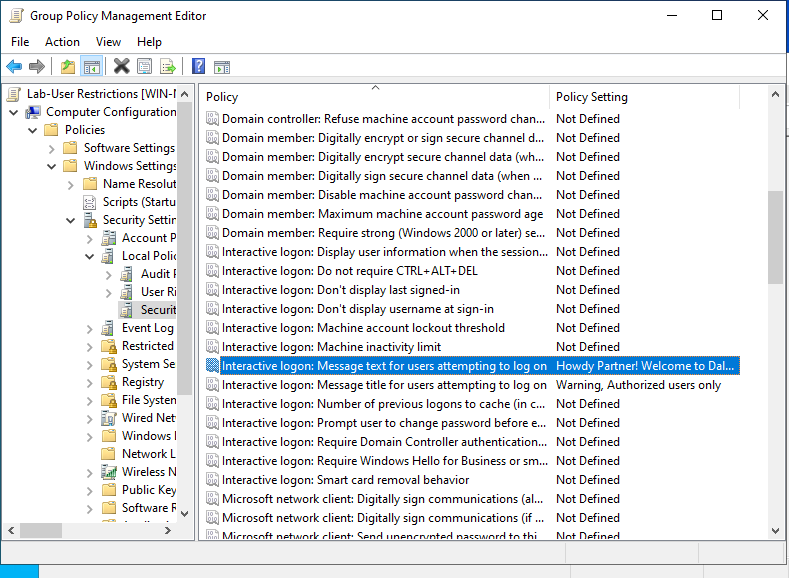
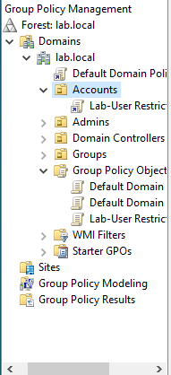
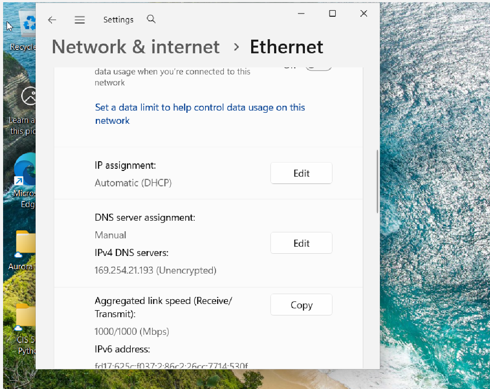
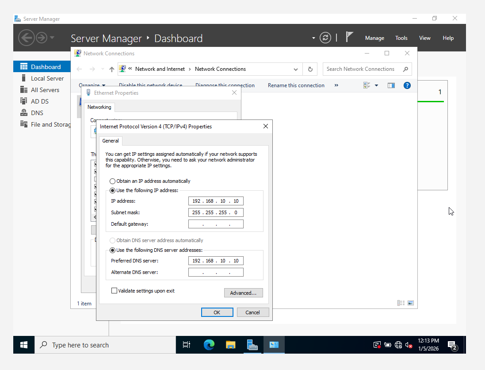
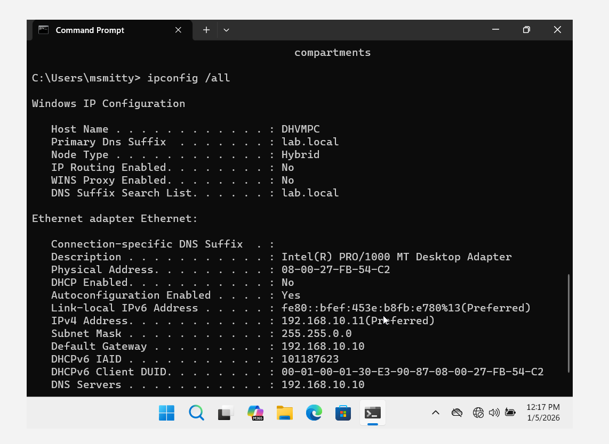
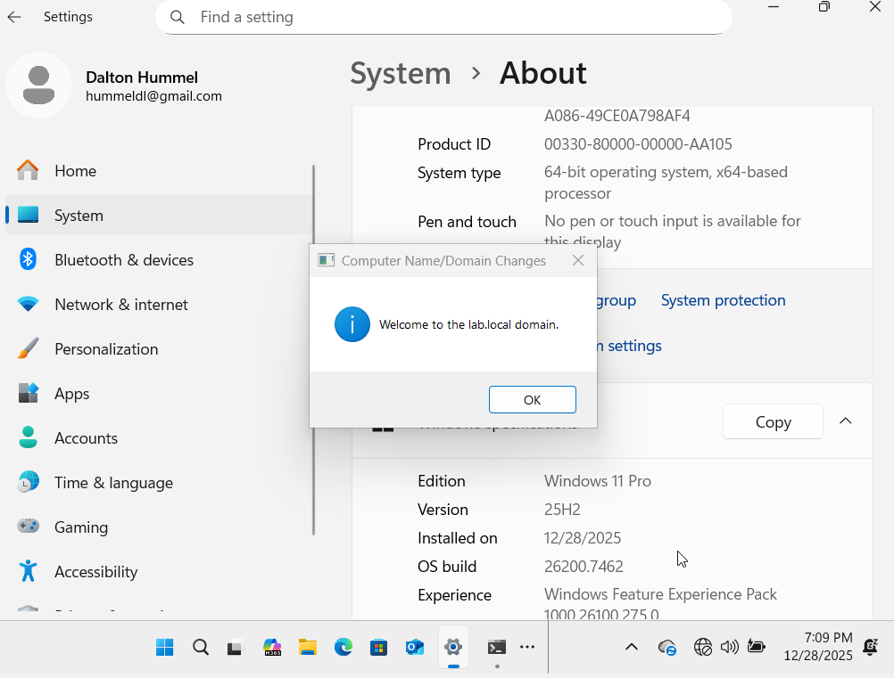
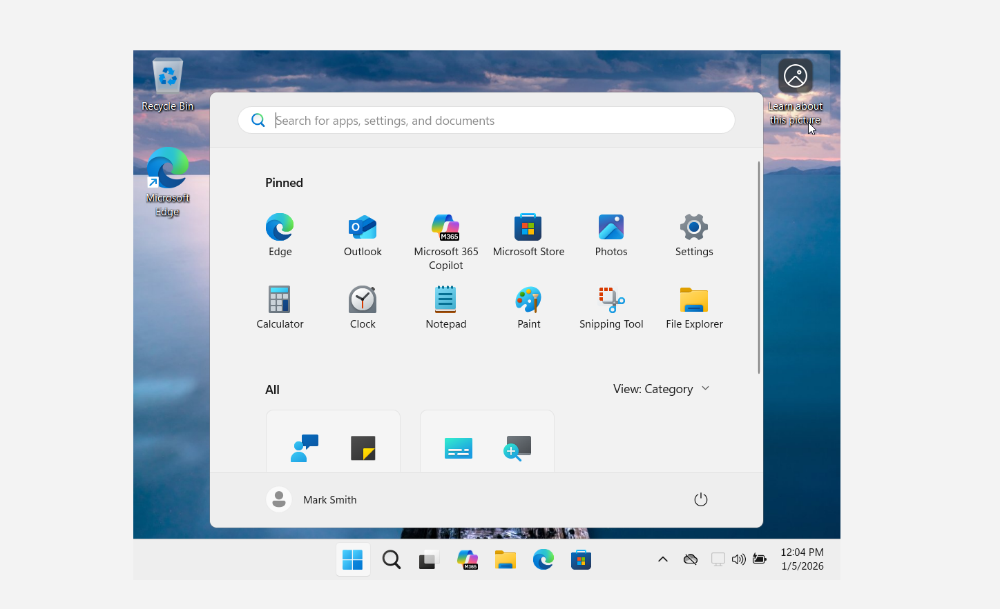
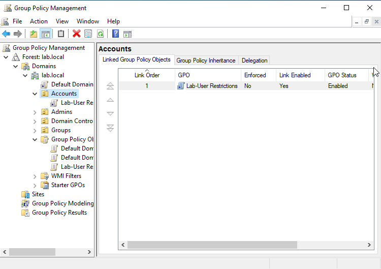

# Active Directory Home Lab (Windows Server + Windows 11 Client)

This project demonstrates building a fully functional Active Directory domain in a virtualized environment.  
I deployed a Windows Server Domain Controller, created OUs & users, configured Group Policy, and joined a Windows 11 workstation to the domain.

---

## 🏗 Lab Architecture

| Component | Role |
|---|---|
| Windows Server 2022 | Domain Controller, DNS |
| Windows 11 Pro | Domain-joined workstation |
| VirtualBox | Virtualization platform |

### Network
`Internal Network`  
Static IPs used for stable DNS/domain connectivity.
DC01   - 192.168.10.10 (DNS + AD DS)  
WIN11  - 192.168.10.11 (Domain Client)  
Domain: lab.local

## 🔐 Active Directory Setup

### Tasks Completed

- Installed Windows Server 2022
- Promoted to Domain Controller (lab.local)
- Added custom OUs:
  - Accounts
  - Groups
  - Admins
- Created domain users
- Configured DNS for client workstation

### Screenshots

  
  
  
  
  

---

## 🏢 Windows 11 Domain Join

Steps:

1. Installed Windows 11 Pro VM
2. Configured client DNS to point to Domain Controller
3. Joined system to lab.local domain
4. Logged in using domain credentials

### Screenshots

## 🛡 Group Policy Deployment

Created security GPO: **Lab-User-Restrictions**

- Interactive Logon Banner applied via GPO
- Linked to **Accounts OU**
- Verified using `gpupdate /force` 

### Screenshots

## 🧠 Skills Demonstrated

- Active Directory Administration
- Group Policy Management
- Domain user + computer management
- DNS configuration + troubleshooting
- Virtualization & internal networking

---

## 🚀 Future Enhancements (Phase 2+)

I plan to expand this lab to include:

- Wazuh/Splunk SIEM setup & log forwarding
- Windows event log monitoring
- Brute-force login alerting
- File integrity monitoring
- Vulnerability scanning lab (Nessus/OpenVAS)
- Attack simulations (mimikatz, DC sync, AD attacks)

---

### 📌 Status

**Completed Phase 1: AD + Domain Join + GPO**  
Phase 2 (SIEM + monitoring) in-progress...
